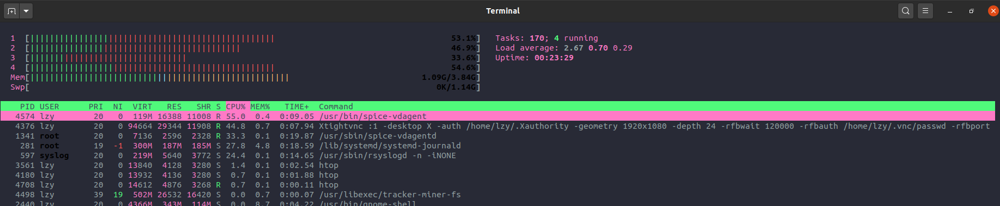

# Ubuntu连Ubuntu

建议xrdp代替vnc。

[old](Ubuntu连Ubuntu 856081913470490e8d6e6b26c3ede3f0/old 85e67c5ffde84957a91d4867c2f20071.md)

使用xfce + tightvnc:

[How to Install and Configure VNC on Ubuntu 20.04 | DigitalOcean](https://www.digitalocean.com/community/tutorials/how-to-install-and-configure-vnc-on-ubuntu-20-04)

中间的step 3可以忽略。

不要有localhost参数，要不然只能本地连接了。

参考~/.vnc/xstartup：

```c
#!/bin/bash
xrdb $HOME/.Xresources
startxfce4 &
```

参考/etc/systemd/system/vncserver@.service，注意添加分辨率。

```c
[Unit]
Description=Start TightVNC server at startup
After=syslog.target network.target

[Service]
Type=forking
User=sammy
Group=sammy
WorkingDirectory=/home/sammy

PIDFile=/home/sammy/.vnc/%H:%i.pid
ExecStartPre=-/usr/bin/vncserver -kill :%i > /dev/null 2>&1
# ExecStart=/usr/bin/vncserver -depth 24 -geometry 1280x800 -localhost :%i
ExecStart=/usr/bin/vncserver -depth 24 -geometry 1920x1080 :%i
ExecStop=/usr/bin/vncserver -kill :%i

[Install]
WantedBy=multi-user.target
```

---

因为之前先安装了tigervnc，再安装tightvnc，有些配置文件还是tigervnc留下来的，需要修改。

文件/etc/X11/Xvnc-session，只需要用xstartup的内容替换掉就可以。

## kvm虚拟机cpu狂飙，日志爆满

按照上面的教程，在kvm虚拟机里安装vnc，然后添加service自动启动。

service自动启动造成日志狂打印。如果手工启动却没有问题。

