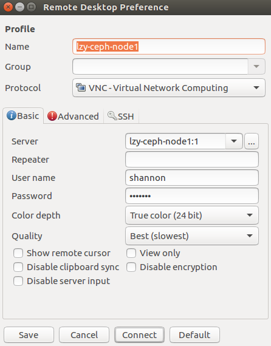

# ubuntu连centos

## centos安装vnc server

```cpp
sudo yum install xrdp tigervnc-server

# 设置密码
vncpasswd shannon

su root
cp /lib/systemd/system/vncserver@.service /lib/systemd/system/vncserver@:1.service
vi /lib/systemd/system/vncserver@:1.service
# 将里面的<USER>替换为shannon

systemctl daemon-reload
systemclt restart vncserver@:1.service
# 开机启动
systemclt enable vncserver@:1.service

# 切换到shannon用户
# 生成配置文件
vncserver
```

## ubuntu客户端连接

使用系统自带的远程连接工具





## 防火墙：本地能连，外部连不了

[https://www.tecmint.com/install-and-configure-vnc-server-in-centos-7/](https://www.tecmint.com/install-and-configure-vnc-server-in-centos-7/)

```python
# firewall-cmd --add-port=5901/tcp
# firewall-cmd --add-port=5901/tcp --permanent
```

## 鼠标点击不了

[https://superuser.com/questions/682287/vnc-console-does-not-accept-any-keyboard-mouse-inputs](https://superuser.com/questions/682287/vnc-console-does-not-accept-any-keyboard-mouse-inputs)

```python
yum install libX11
```

然后重启vncserver