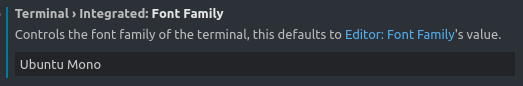
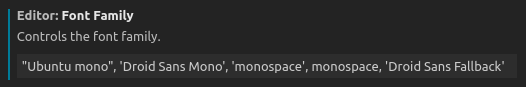

# Ubuntu下终端不显示下划线

终端terminal的字体可以改为Ubuntu mono，编辑器的字体可以是其他的：

[New terminal lines rendering cuts off bottom/top of characters like underscore · Issue #35901 · microsoft/vscode](https://github.com/microsoft/vscode/issues/35901)

---

修改字体为`Ubuntu mono`：同时大小改为16比较顺眼

