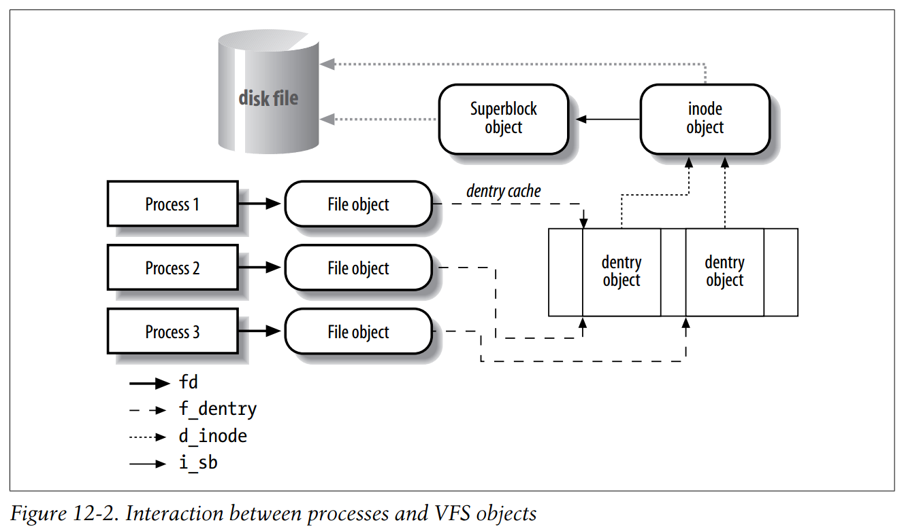

# 12. The Virtual Filesystem

2020-12-04 11:14:07，阅。



## 关键数据结构

- file_operations
- super_block
- inode
    
    ```python
    typedef unsigned short		umode_t;
    ```
    
- file
- dentry
- fs_struct，进程当前目录及根目录
- files_struct，进程打开的文件