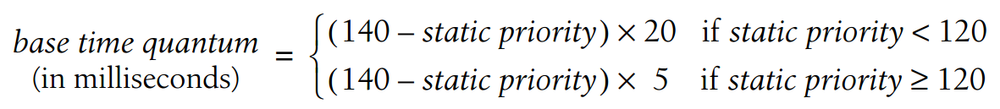
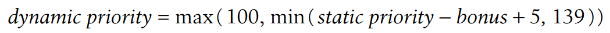

# 7. Process Scheduling

2020-11-18 18:19:00，阅

## 优先级概念

- 每个进程都有一个静态优先级(static priority)，值的范围为100（高优先级）到139（低优先级）。
- 新进程总是继承父进程的静态优先级。
- 静态优先级可通过`nice`跟`setpriority`系统调用来修改。
- 静态优先级直接与分配到的时间片相关，叫做base time quantum。
    
    
    
- 另一个概念是动态优先级（dynamic priority），也是从100（高）到139（低）。
    
    