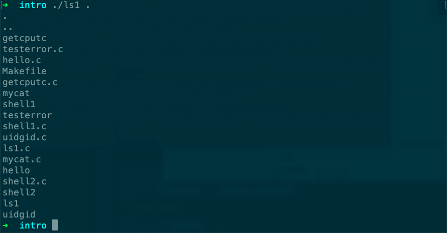

# ls1

Desc: ls模拟。
Listing the names of all the files in a directory.
Figure: 1.3
File: ls1.c
备注: 列出的文件名是无序的。



```c
#include "apue.h"
#include <dirent.h>

int
main(int argc, char *argv[])
{
    DIR             *dp;
    struct dirent   *dirp;

    if (argc != 2)
        err_quit("usage: ls directory_name");

    if ((dp = opendir(argv[1])) == NULL)
        err_sys("can't open %s", argv[1]);
    while ((dirp = readdir(dp)) != NULL)
        printf("%s\n", dirp->d_name);

    closedir(dp);
    exit(0);
}
```