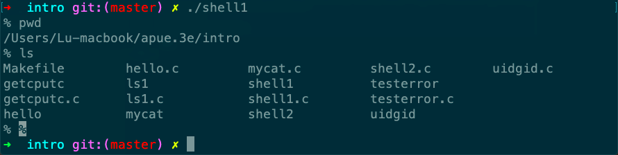

# shell1

Desc: reads commands from standard input and executes the commands
Figure: 1.7
File: shell1.c
备注: 读入命令并在子进程号执行



```c
#include "apue.h"
#include <sys/wait.h>

int
main(void)
{
    char     buf[MAXLINE];    /* from apue.h */
    pid_t    pid;
    int      status;

    printf("%% ");    /* print prompt (printf requires %% to print %) */
    while (fgets(buf, MAXLINE, stdin) != NULL) {
        if (buf[strlen(buf) - 1] == '\n')
            buf[strlen(buf) - 1] = 0; /* replace newline with null */

        if ((pid = fork()) < 0) {
            err_sys("fork error");
        } else if (pid == 0) {        /* child */
            execlp(buf, buf, (char *)0);
            err_ret("couldn't execute: %s", buf);
            exit(127);
        }

        /* parent */
        if ((pid = waitpid(pid, &status, 0)) < 0)
            err_sys("waitpid error");
        printf("%% ");
    }
    exit(0);
}
```