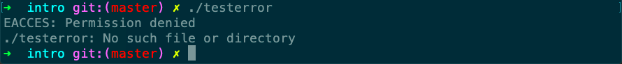

# testerror

Desc: 打印错误信息
Figure: 1.8
File: testerror.c
备注: stderror, perror



```c
#include "apue.h"
#include <errno.h>

int
main(int argc, char *argv[])
{
    fprintf(stderr, "EACCES: %s\n", strerror(EACCES));
    errno = ENOENT;
    perror(argv[0]);
    exit(0);
}
```