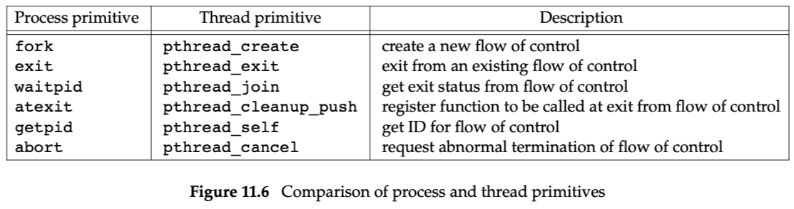

# Chapter 11: Threads

- 线程包含元素：
    - thread ID
    - register values
    - stack
    - scheduling priority, policy
    - signal mask
    - errno
    - thread specific data
- 进程内的资源都可以共享
    - 代码段
    - global data、heap memory
    - stack
    - file descriptors
- pthreads: POSIX threads
- five fundamental synchronization mechanisms —
    - mutexes
    - reader–writer locks
    - `condition variables`
    - spin locks
    - barriers
    - 信号量呢？semaphores

## 11.3 Thread Identification

- pthread_t，不保证是整数类型。
- 线程ID只需要在进程内唯一就行。

## 11.4 Thread Creation

- pthread_create

## 11.5 Thread Termination

- If any thread within a process calls exit, _Exit, or _exit, then the entire process terminates.
- 线程自个退出，不影响整体进程的方式：
    1. The thread can simply `return` from the start routine. The return value is the thread’s exit code.
    2. The thread can be `canceled` by another thread in the same process.
    3. The thread can call `pthread_exit`.
- pthread_join: 调用者阻塞，直到目标线程结束。
- pthread_cancel: 只是请求取消线程，不会阻塞。

## 11.6 Thread Synchronization

- lock

### 11.6.1 Mutexes，互斥锁

- We can protect our data and ensure `access by only one thread at a time` by using the pthreads mutual-exclusion interfaces.
- This mutual-exclusion mechanism works only if we design our threads to follow the same data-access rules.
- 需要各线程遵循一样的规则。如果有破坏者绕过lock，直接访问共享变量，OS也拦不住。
- 类型为pthread_mutex_t
- deadlock

### 11.6.4 Read-Writer Locks

- 三种模式：
    - unblocked
    - write mode，只能有一个，其他不管要读锁还是写锁，都要block
    - read mode，可同时有多个，其他请求读锁可通过，请求写锁要block。有些实现，如果有写锁请求，那么就不能再接受读锁请求，防止写请求饥饿。另外，同时读的数量一般有限制。

### 11.6.6 Condition Variables

[When to use pthread conditional variables?](https://stackoverflow.com/questions/20772476/when-to-use-pthread-conditional-variables)

[Conditional Variable vs Semaphore](https://stackoverflow.com/questions/3513045/conditional-variable-vs-semaphore)

- 具体是什么条件这个属于程序的语义，condition variable只是提供了wait（休眠）与signal（唤醒）的机制。
- 需要外部提供一个mutex。
- condition variable可用来避免盲等

## 例子

[Examples](assets/Examples%20afe1b5eb220b4b82a00a17f91e0e86d6.csv)