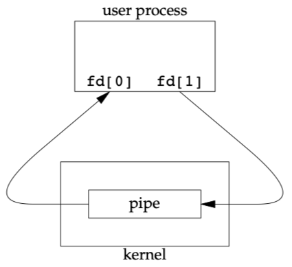
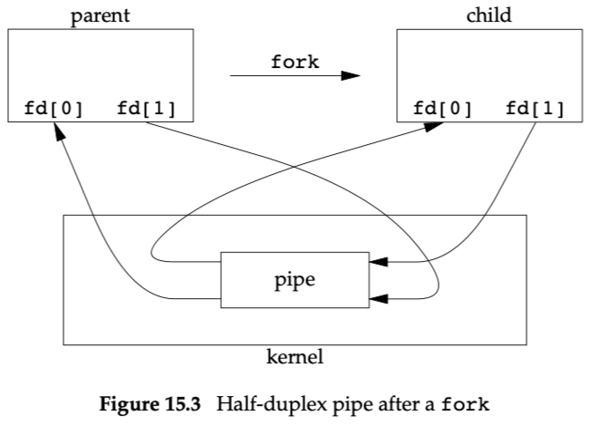
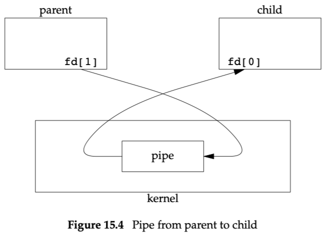

# Chapter 15: Interprocess Communication

## 15.2 Pipes

- half duplex
- Pipes can be used only between processes that have a common ancestor. 比如父子进程
- int pipe(int fd[2]);
    - fd[1] → fd[0]，半双工，fd[0]用于读，fd[1]用于写。
    
    
    
    
    
    fd[0]和fd[1]在父子进程都是打开的，如果要保持父进程向子进程单方向写，那么，只需要在父进程关闭读fd[0]、子进程关闭写fd[1]即可。
    
    
    

## 15.3 popen and pclose Functions

- 

## FIFOs

named pipes

## Message Queues

## Semaphores

## Shared Memory