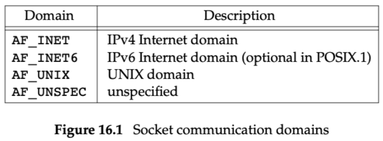
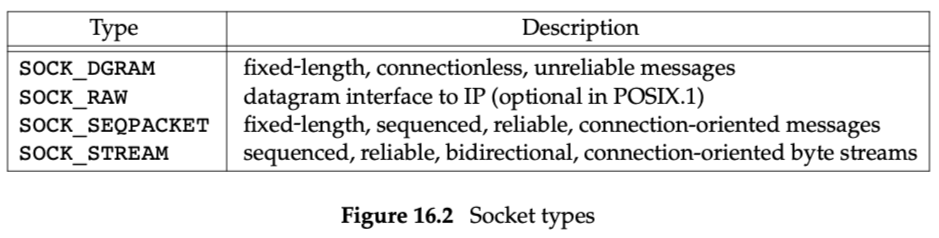
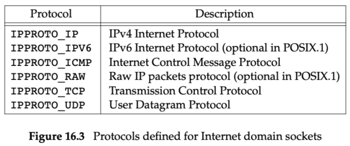
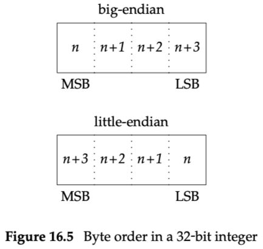

# Chapter 16: Network IPC: Sockets

- Stevens, Fenner, and Rudoff [2004]: UNIX Network Programming
- 

- The TCP/IP protocol suite uses `big-endian` byte order.
- 如何运行`ruptime`示例（mac os）
    - 给系统添加ruptime服务，在/etc/services添加
        - ruptime 4000/tcp
    - 启动server端
        - ./ruptimed，弹框时允许网络访问，会后台运行（守护进程）
    - 查看本机网络名
        - 命令hostname：Lus-MacBook-Air.local
    - 启动client端
        
        