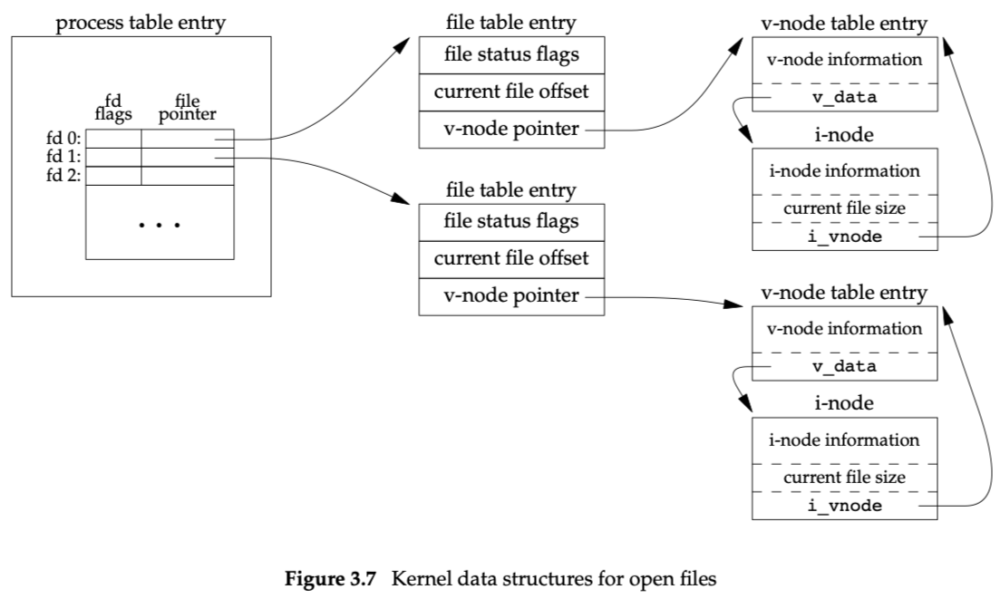
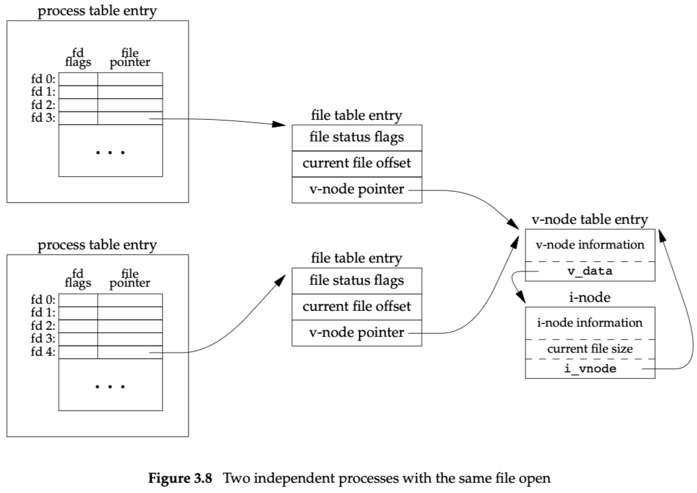
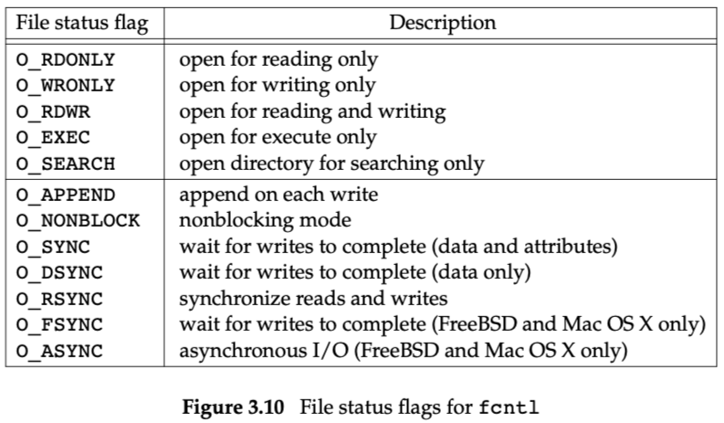

# Chapter 3: File I/O

代码目录为fileio

两个打开同一个文件：

每个进程都有自己的file table，这样可以独立维护各自文件的状态，如flag及offset。

同一个进程内，也可以有多个fd指向同一个file table entry (dup)。

file table entry是属于进程还是属于内核管理？属于内核。

The kernel maintains a file table for all open files.

O_APPEND保证在每次write之前，将offset更新到文件末尾。

---

O_CREAT and O_EXCL：当这两个组合同时存在时，只有文件不存在时，才能open成功（真的创建文件）。检查与创建合并为一个原子操作。

file descriptor flags与file status flags？

dup2?

---

针对同一个文件，不同进程各自打开时，内核中分别有各自的file table entry，只是vnode指向同一个。

## 例子

[Examples](assets/Examples.csv)