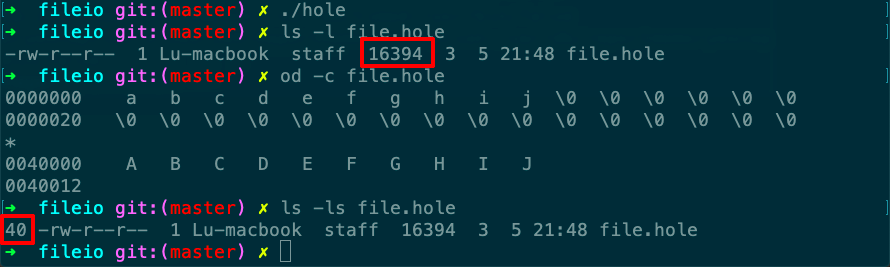

# hole

Desc: creates a file with a hole in it
Figure: 3.2
File: hole.c
备注: Mac环境下hole实际是真实填充的



```c
#include "apue.h"
#include <fcntl.h>

char    buf1[] = "abcdefghij";
char    buf2[] = "ABCDEFGHIJ";

int
main(void)
{
    int        fd;

    if ((fd = creat("file.hole", FILE_MODE)) < 0)
        err_sys("creat error");

    if (write(fd, buf1, 10) != 10)
        err_sys("buf1 write error");
    /* offset now = 10 */

    if (lseek(fd, 16384, SEEK_SET) == -1)
        err_sys("lseek error");
    /* offset now = 16384 */

    if (write(fd, buf2, 10) != 10)
        err_sys("buf2 write error");
    /* offset now = 16394 */

    exit(0);
}
```