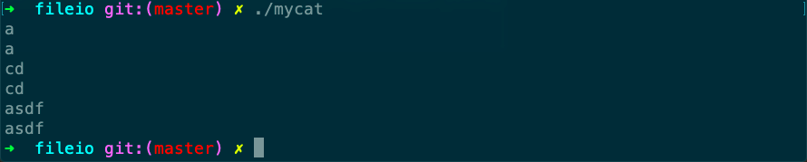

# mycat

Desc: copies a file
Figure: 3.5
File: mycat.c
备注: 文本文件及二进制文件均可



```c
#include "apue.h"

#define    BUFFSIZE    4096

int
main(void)
{
    int     n;
    char    buf[BUFFSIZE];

    while ((n = read(STDIN_FILENO, buf, BUFFSIZE)) > 0)
        if (write(STDOUT_FILENO, buf, n) != n)
            err_sys("write error");

    if (n < 0)
        err_sys("read error");

    exit(0);
}
```