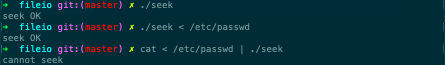

# seek

Desc: tests its standard input to see whether it is capable of seeking
Figure: 3.1
File: seek.c



```c
#include "apue.h"

int
main(void)
{
    if (lseek(STDIN_FILENO, 0, SEEK_CUR) == -1)
        printf("cannot seek\n");
    else
        printf("seek OK\n");
    exit(0);
}
```