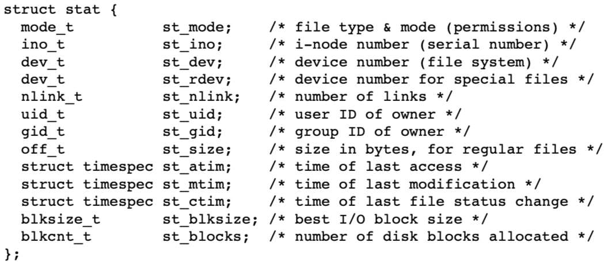
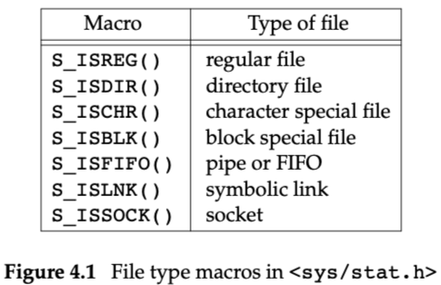
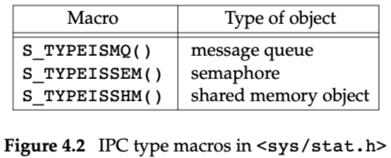
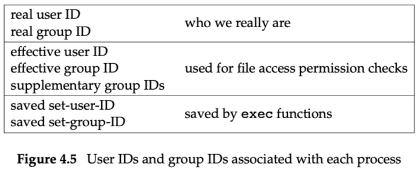
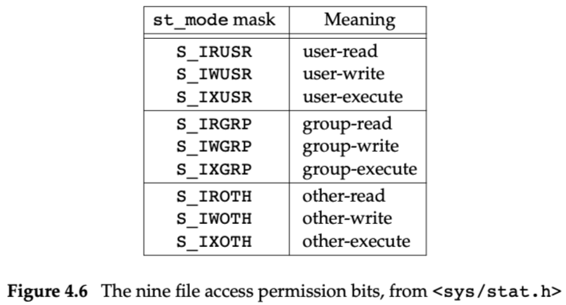
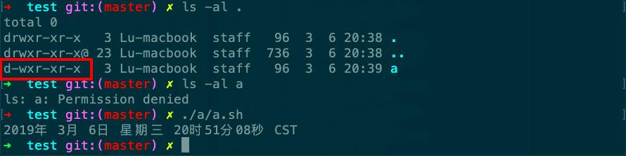
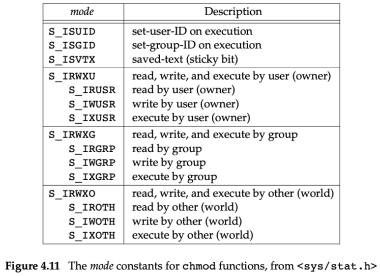
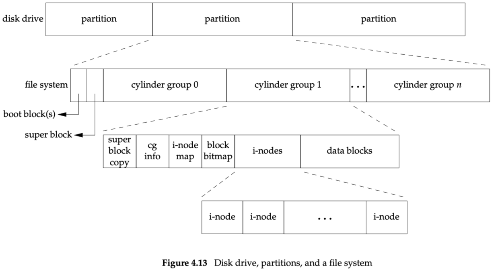
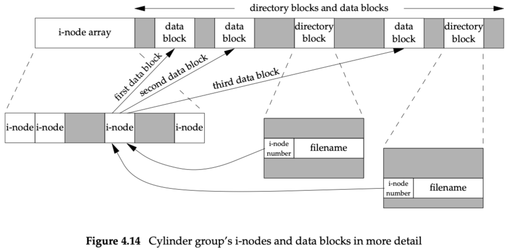
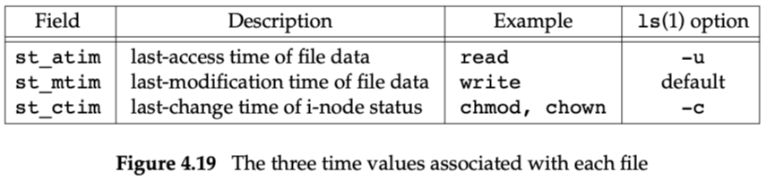

# Chapter 4: Files and Directories

代码对应目录为filedir。

判断文件类型：

IPC文件类型判断（一般并不被视为文件）：

st_mode包含的信息有：

- 文件类型
- set-user-ID bit和set-group-ID bit
- 文件访问权限

---

the UNIX System program that allows anyone to change his or her password, passwd(1), is a set-user-ID program

文件访问权限：

要打开一个文件，该路径上的所有目录权限必须有执行权限。

This is why the execute permission bit for a directory is often called the search bit.

对目录来说，执行权限代表了能否进入该目录；read权限表示能否读取目录内容，也就是文件列表。

目录a有执行权限，无读权限。ls失败，但执行里面的脚本a.sh却能成功。cd能够进去。

---

When this file is executed, set the effective user ID of the process to be the owner of the file (`st_uid`). 允许以owner ID来执行，但read跟write还是要检查原来的ID。

## chmod

## chown

## file size

- st_size
- st_blksize
- st_blocks

## File Systems

## link

## rename

## File Times

## mkdir，rmdir

## 例子

[Examples](assets/Examples.csv)