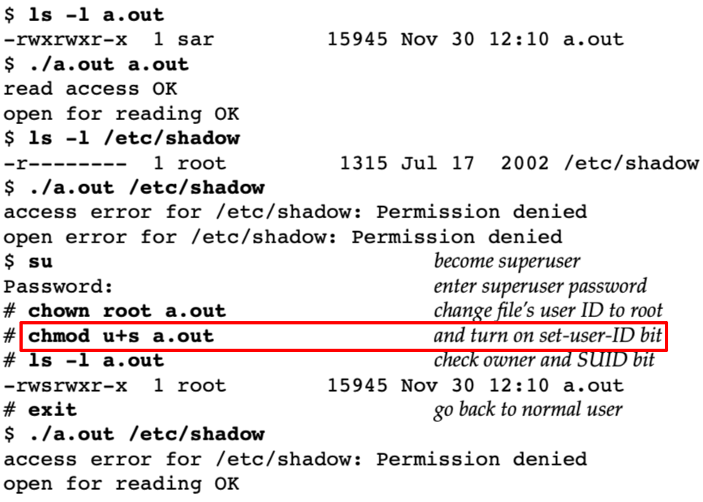

# access

Desc: use of the access function
Figure: 4.8
File: access.c



```c
#include "apue.h"
#include <fcntl.h>

int
main(int argc, char *argv[])
{
    if (argc != 2)
        err_quit("usage: a.out <pathname>");
    if (access(argv[1], R_OK) < 0)
        err_ret("access error for %s", argv[1]);
    else
        printf("read access OK\n");
    if (open(argv[1], O_RDONLY) < 0)
        err_ret("open error for %s", argv[1]);
    else
        printf("open for reading OK\n");
    exit(0);
}
```