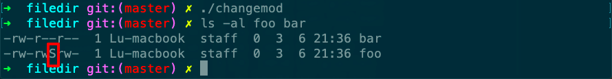

# changemod

Desc: use of the chmod function
Figure: 4.12
File: changemod



```c
#include "apue.h"

int
main(void)
{
    struct stat        statbuf;

    /* turn on set-group-ID and turn off group-execute */

    if (stat("foo", &statbuf) < 0)
        err_sys("stat error for foo");
    if (chmod("foo", (statbuf.st_mode & ~S_IXGRP) | S_ISGID) < 0)
        err_sys("chmod error for foo");

    /* set absolute mode to "rw-r--r--" */

    if (chmod("bar", S_IRUSR | S_IWUSR | S_IRGRP | S_IROTH) < 0)
        err_sys("chmod error for bar");

    exit(0);
}
```