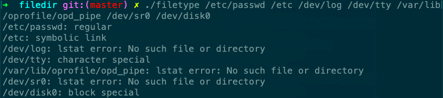

# filetype

Desc: Print type of file for each command-line argument
Figure: 4.3
File: filetype.c



```c
#include "apue.h"

int
main(int argc, char *argv[])
{
    int            i;
    struct stat    buf;
    char           *ptr;

    for (i = 1; i < argc; i++) {
        printf("%s: ", argv[i]);
        if (lstat(argv[i], &buf) < 0) {
            err_ret("lstat error");
            continue;
        }
        if (S_ISREG(buf.st_mode))
            ptr = "regular";
        else if (S_ISDIR(buf.st_mode))
            ptr = "directory";
        else if (S_ISCHR(buf.st_mode))
            ptr = "character special";
        else if (S_ISBLK(buf.st_mode))
            ptr = "block special";
        else if (S_ISFIFO(buf.st_mode))
            ptr = "fifo";
        else if (S_ISLNK(buf.st_mode))
            ptr = "symbolic link";
        else if (S_ISSOCK(buf.st_mode))
            ptr = "socket";
        else
            ptr = "** unknown mode **";
        printf("%s\n", ptr);
    }
    exit(0);
}
```