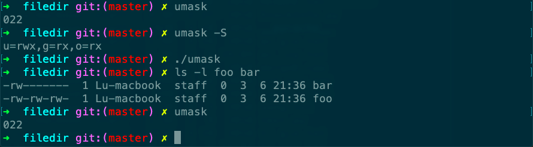

# umask

Desc: use of the umask function
Figure: 4.9
File: umask.c
备注: 如果umask里置位了，对应的权限是被关闭的



```c
#include "apue.h"
#include <fcntl.h>

#define RWRWRW (S_IRUSR|S_IWUSR|S_IRGRP|S_IWGRP|S_IROTH|S_IWOTH)

int
main(void)
{
    umask(0);
    if (creat("foo", RWRWRW) < 0)
        err_sys("creat error for foo");
    umask(S_IRGRP | S_IWGRP | S_IROTH | S_IWOTH);
    if (creat("bar", RWRWRW) < 0)
        err_sys("creat error for bar");
    exit(0);
}
```