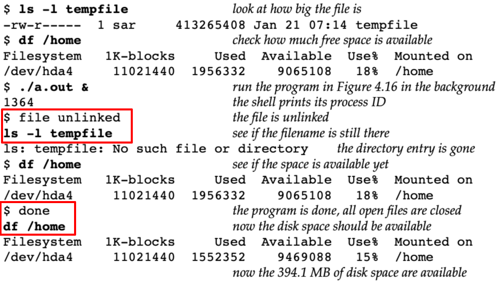

# unlink

Desc: opens a file and then unlinks it
Figure: 4.16
File: unlink
备注: 虽然程序执行中unlink了，但文件此时并没有被删除，程序结束时，kernel才会去清理



```c
#include "apue.h"
#include <fcntl.h>

int
main(void)
{
    if (open("tempfile", O_RDWR) < 0)
        err_sys("open error");
    if (unlink("tempfile") < 0)
        err_sys("unlink error");
    printf("file unlinked\n");
    sleep(15);
    printf("done\n");
    exit(0);
}
```