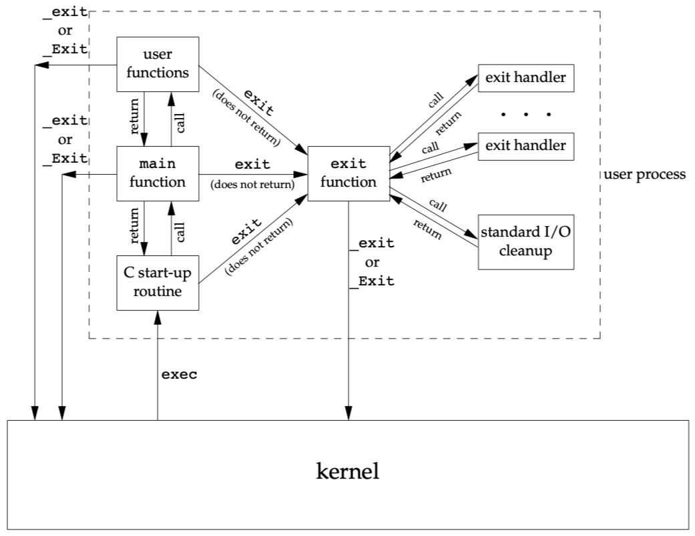
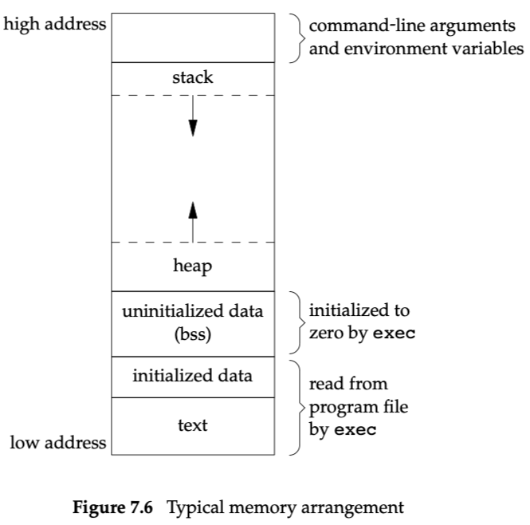

# Chapter 7: Process Environment

代码目录为environ。

main程序的开始与结束：

## Memory Allocation

- quick-fit, Weinstock and Wulf [1988]
- jemalloc, FreeBSD 8.0, Evans [2006]
- TCMalloc, Google, Ghemawat and Menage [2005]

## 例子

[Examples](assets/Examples.csv)