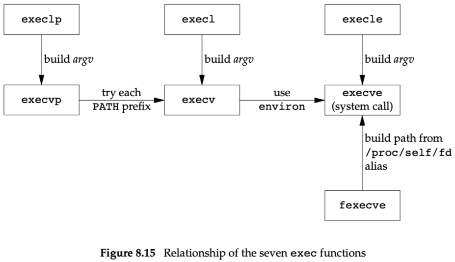
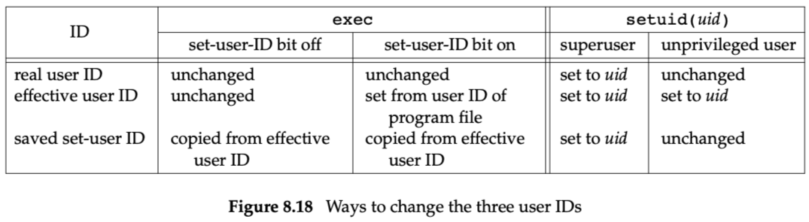

# Chapter 8: Process Control

代码目录在proc。

- `Process ID 0` is usually the `scheduler process` and is often known as the `swapper`. No program on disk corresponds to this process, which is part of the kernel and is known as a `system process`.
- `Process ID 1` is usually the `init` process and is invoked by the kernel at the end of the bootstrap procedure.
    - The init process never dies.
    - normal user process，但有超级用户权限。
    - `init` becomes the parent process of any orphaned child process.

## 8.3 fork Function

- This function `fork` is called once but returns twice.
- Both the child and the parent continue executing with the instruction that follows the call to fork.

## 8.4 vfork Function

- Portable applications should not use it.

## 8.5 exit Function

- zombie进程怎么消失？（如果父进程没有调用wait而且退出了呢？）

## 8.6 wait and waitpid Functions

- 

[Test cases in C for WIFSIGNALED, WIFSTOPPED, WIFCONTINUED](https://stackoverflow.com/questions/907867/test-cases-in-c-for-wifsignaled-wifstopped-wifcontinued)

## exec Functions

fexecve要不要关闭fd呢？

## 8.11 Changing User IDs and Group IDs

## 8.16 Process Scheduling

- 一般进程可以主动降低自己的优先级（nice value），只有特权线程可以提升自己的优先级。
- nice values range from 0 to (2*NZERO)−1
    - nice值越大（对别人越nice），优先级越低
    - NZERO is the default nice value of the system.
- 

## 例子

[Examples](assets/Examples.csv)