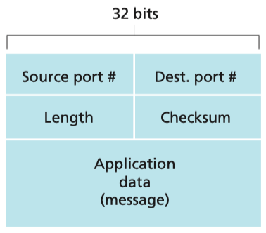
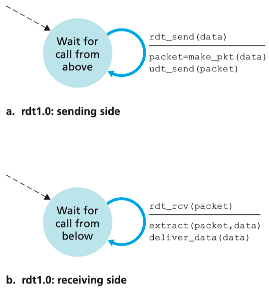
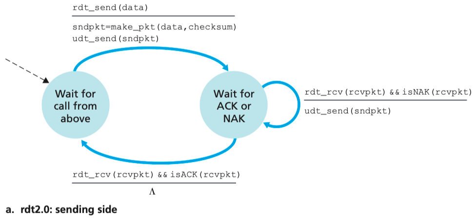
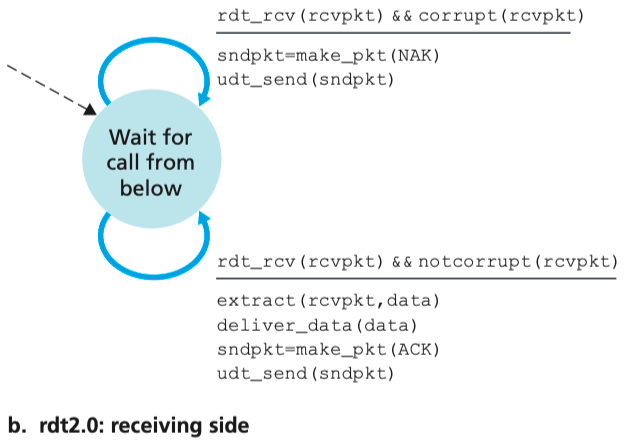
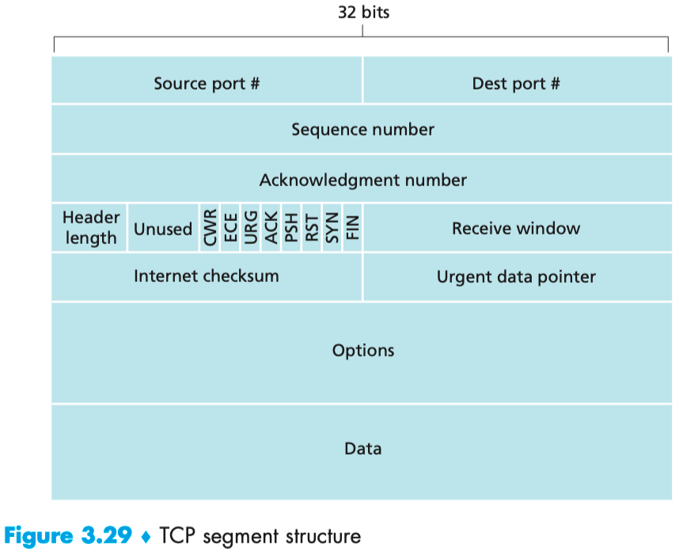

# 3. Transport Layer

## 3.1 Introduction and Transport-Layer Services

- TCP
    - reliable data transfer
    - congestion control

## 3.2 Multiplexing and Demultiplexing

- 传输层收到的包向上提供给哪个应用（socket）？使用端口号
    - (1) that sockets have unique identifiers
    - (2) that each segment have special fields that indicate the socket to which the segment is to be delivered
    - Each port number is a 16-bit number, ranging from 0 to 65535.
- `TCP socket` is identified by a four-tuple: (source IP address, source port number, destination IP address, destination port number)

## 3.3 Connectionless Transport: UDP

- 无握手，无连接，无状态。端口+简单的错误检查。RFC 768
- DNS
- SNMP
- 可靠性可以在应用层实现。

- UDP的checksum计算方式：以16位为单位，累加起来，高位溢出的进位放到低位继续加。最后使用1的补码，也就是0变1，1变0，作为checksum。那么，接收方收到后，全加起来应该是全1。
- 传输层不能够依赖底层的错误检测，而应该使用end-end principle，在自己这一层解决。
- UDP提供错误检测，但没有纠错能力。

## 3.4 Principles of Reliable Data Transfer

- With a reliable channel, no transferred data bits are corrupted (flipped from 0 to 1, or vice versa) or lost, and all are delivered in the order in which they were sent.
    - 底层是不可靠的，可能会丢包、包损坏、到达顺序与发送顺序不一样。但假设底层是按照收包顺序转发包的，没有重新排序。
- rdt1.0，假设底层是完全可靠的
    
    状态机：
    
    
    
- rdt2.0，数据可能会被破坏
    - ARQ (Automatic Repeat reQuest) protocols
    - Error detection. 比如checksum，接收者检测。
    - Receiver feedback. 比如ACK与NAK，接收者回复。
    - Retransmission. 发送者重发。
    
    状态机：
    
    
    
    
    
    - rdt2.0也称为stop-and-wait protocols，因为发送一个包，ACK后，再发送下一个包。
    - 有个致命缺陷：接收者发送的ACK或NAK也有可能损坏。ACK包也要加上checksum，但是发送者只是收到一个损坏的包，并不知道它是不是ACK，所以并不会出发重发。
        - 解决办法：添加一个字段，sequence number
- rdt3.0
    - 现在底层会丢包
    - how to detect packet loss and what to do when packet loss occurs
    - 使用timeout

---

性能问题：stop-and-wait，使用pipeline，同时发送多个包

重发机制：Go-Back-N and selective repeat

## 3.5 Connection-Oriented Transport: TCP

- connection-oriented, reliable
- TCP运行在两个终端（end system），中间网络不关心TCP的状态。
- 全双工，点对点
- 三次握手，three-way handshake

- sequence number & acknowledgement number: 用来实现可靠机制
    - sequence number：字节流的偏移地址
    - acknowledgement number：接收端通知发送端下次发送的起始地址，也就是说，它之前的数据都以完整收到。
    - 起始号其实是建立连接时随机选的，从0开始只是逻辑上对待。
- Telnet
- Go-Back-N or Selective Repeat?

## 3.6 Principles of Congestion Control