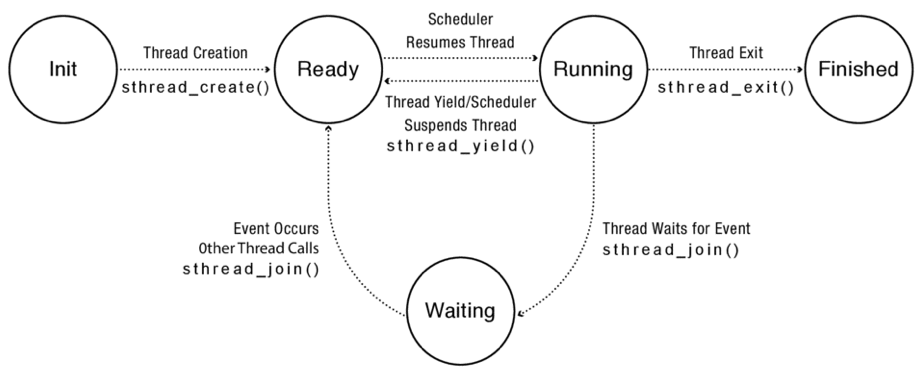

# Chapter 4: Concurrency and Threads

- four reasons to use threads
    - Program structure: expressing logically concurrent tasks.
    - Responsiveness: shifting work to run in the background
    - Performance: exploiting multiple processors.
    - Performance: managing I/O device
- 

