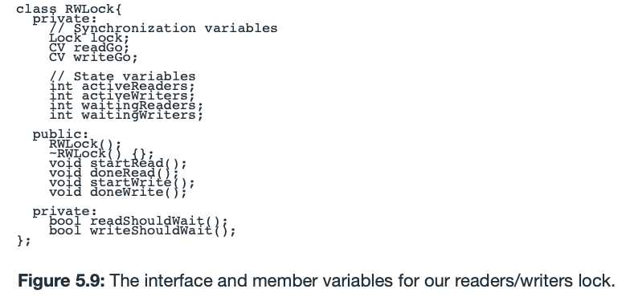
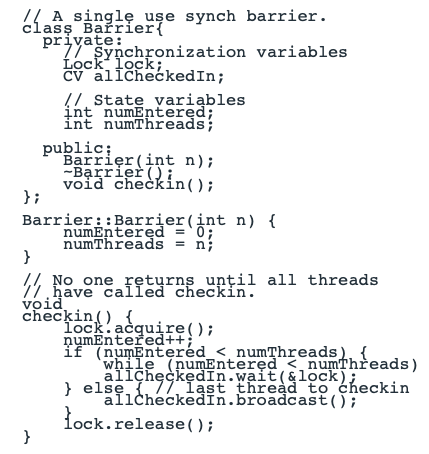

# Chapter 5: Synchronizing Access to Shared Objects

- condition variable
    - signal之后，将等待线程从cv中移出，放到READY队列，运行的时候会去require lock，可能仍然会被阻塞，但此时已经不在cv上等待，而是在lock上等待，等别人release lock。
- 使用Lock和CV实现读写锁：
    
    
    
- 使用Lock和CV实现synchronization barrier：
    
    